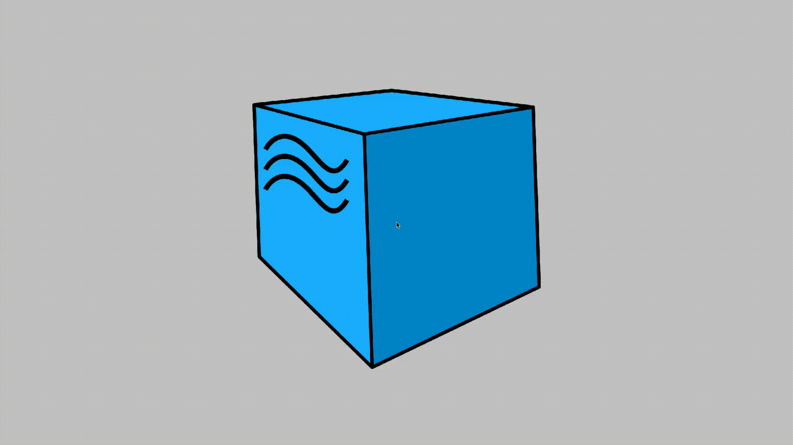
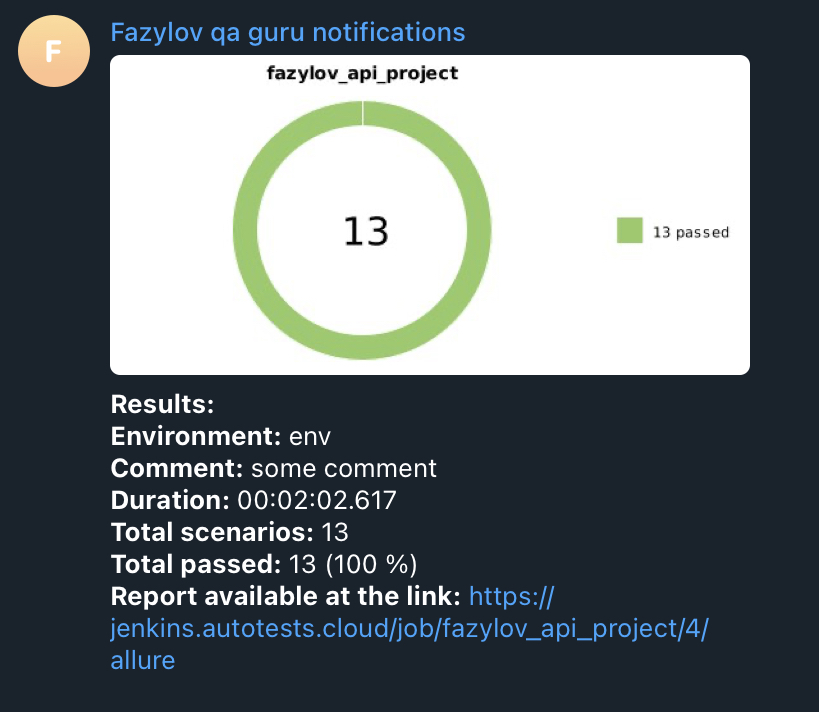

## Проект API автотестов

<!-- Технологии -->

### Используемые технологии

  <code></code>
  <code></code>
  <code></code>
  <code></code>
  <code></code>
  <code></code>
  <code></code>
  <code></code>
  <code></code>
  <code></code>

### Что проверяется в тестах:
#### Для сайта reqres.in:
- [x] Успешное создание пользователя
- [x] Успешное обновление данных пользователя методом PATCH
- [x] Успешное обновление данных пользователя методом PUT
- [x] Успешное удаление пользователя
- [x] Успешная регистрация
- [x] Безуспешная регистрация из-за отсутствия пароля
- [x] Безуспешная регистрация из-за отсутствия электронной почты
#### Для сайта demowebshop.tricentis.com:
- [x] Успешный логин
- [x] Успешный логин посредством апи
- [x] Добавление товара в Корзину
- [x] Добавление товара в Желаемое
- [x] Удаление товара из Корзины
- [x] Удаление товара из Желаемого

В проекте используется встроенный logger:

<!-- Jenkins -->

###  Запуск проекта в Jenkins

### [Job](https://jenkins.autotests.cloud/job/fazylov_api_project/)

##### При нажатии на кнопку "Собрать сейчас" начинается сборка тестов и их прохождение

<!-- Allure report -->

###  Allure report

##### После прохождения тестов, результаты автоматически сохраняются. Чтобы посмотреть Allure отчет, нужно нажать на иконку allure report у сборки.

##### Во вкладке Suites находятся подробные данные о прохождении теста с приложенными логами и скриншотами/видео о прохождении

##### Видео-прохождение теста

##### В канал в мессенджере telegram приходит краткая версия отчёта с ссылкой на полноценную версию в аллюре

