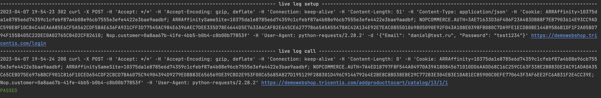
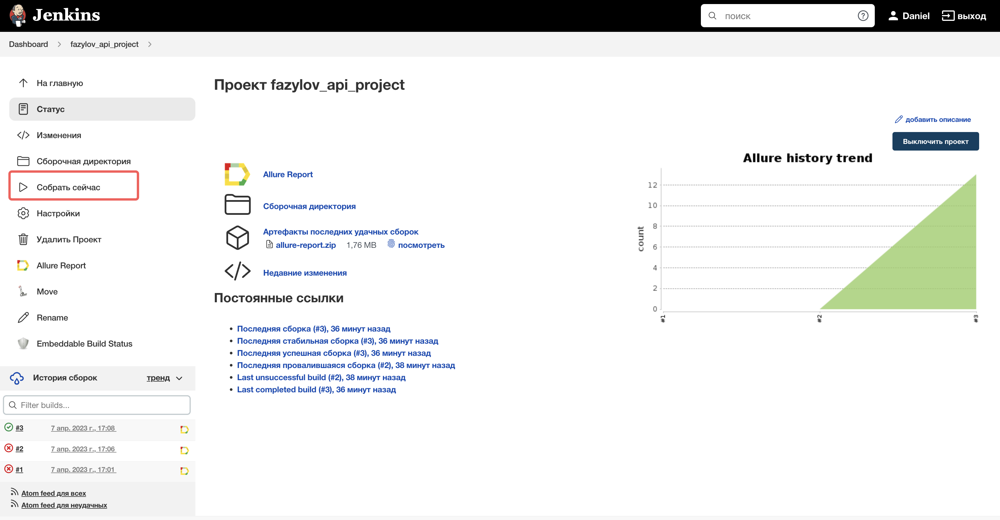
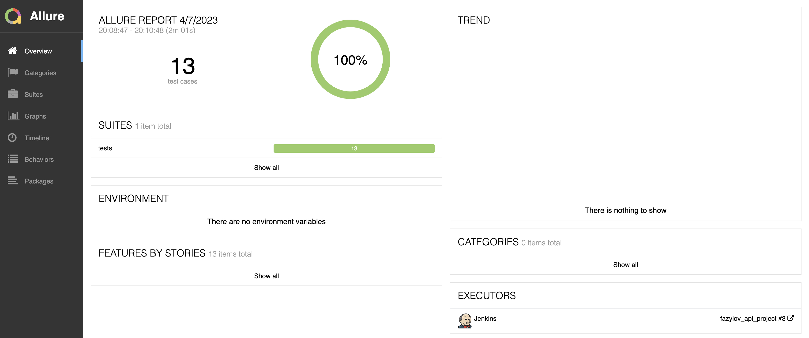
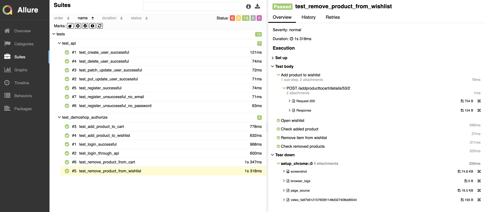

## Проект API автотестов

<!-- Технологии -->

### Используемые технологии

  <code></code>
  <code></code>
  <code></code>
  <code></code>
  <code></code>
  <code></code>
  <code></code>
  <code></code>
  <code></code>
  <code></code>

В проекте используется встроенный logger:

<!-- Jenkins -->

###  Запуск проекта в Jenkins

### [Job](https://jenkins.autotests.cloud/job/fazylov_api_project/)

##### При нажатии на кнопку "Собрать сейчас" начинается сборка тестов и их прохождение

<!-- Allure report -->

###  Allure report

##### После прохождения тестов, результаты автоматически сохраняются. Чтобы посмотреть Allure отчет, нужно нажать на иконку allure report у сборки.

##### Во вкладке Suites находятся подробные данные о прохождении теста с приложенными логами и скриншотами/видео о прохождении

